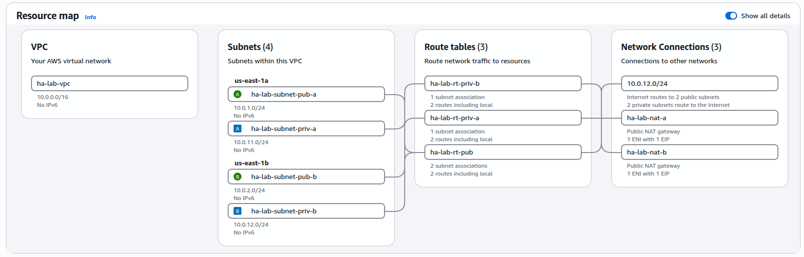
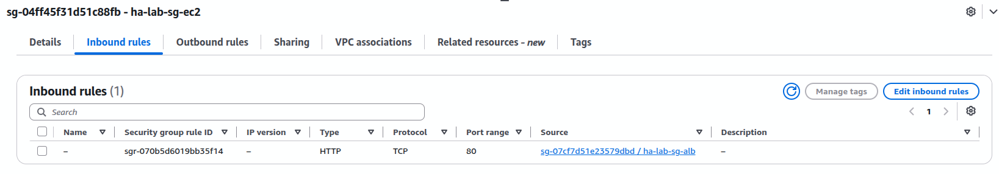
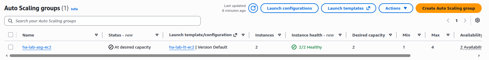
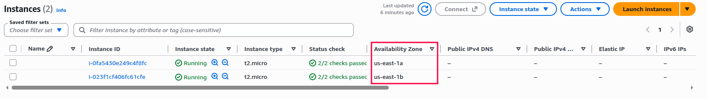
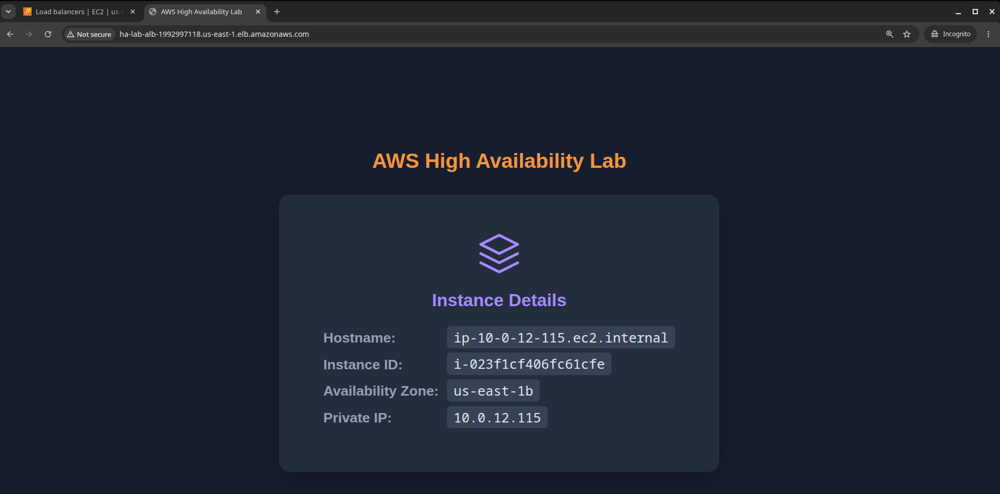
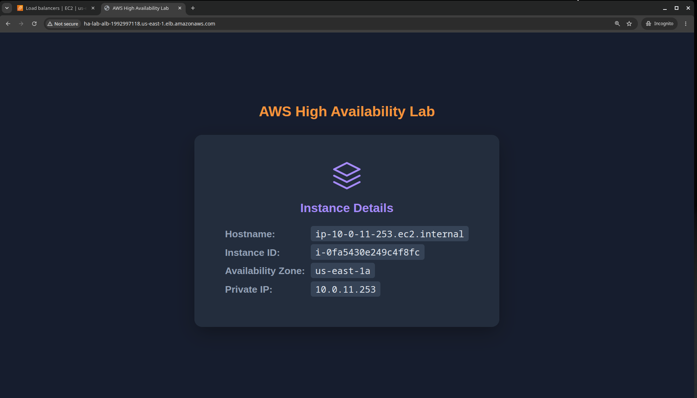
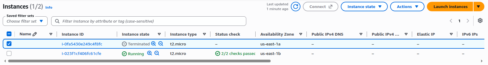
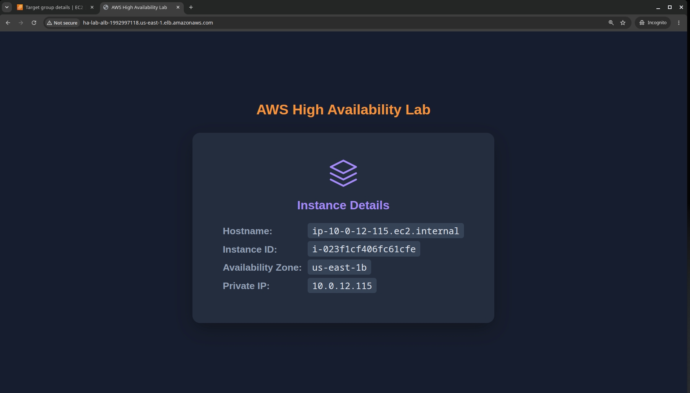

# AWS Hands-On Lab: High Availability Platform

## ☁️ Overview

This lab demonstrates how to build a highly available architecture on AWS. The design distributes traffic across multiple Availability Zones, and isolates resources through public and private subnets. Connectivity to the internet is handled by an Internet Gateway for public resources and a NAT Gateway for private ones, while Security Groups control inbound and outbound traffic to EC2.

## 🎯 Objective

The goal of this lab is to reinforce core AWS networking, security, and high availability best practices.

By the end of this lab, the following will be demonstrated:
- Designing a multi-AZ architecture for fault tolerance.
- Configuring public and private subnets with proper routing.
- Applying security and networking best practices on AWS.

## 📋 Prerequisites

- An AWS account (this lab uses a playground account provided by KodeKloud).

## ⚙️ Implementation

### Phase 1 - Architecture Design

This phase defines the architectural blueprint of the platform: the components involved, how they are distributed, and the reasoning behind each design decision. Detailed configuration values are covered in the implementation phases.

#### Region and Availability Zones

- **Region:** us-east-1 (N. Virginia)
- **Availability Zones:** two AZs (us-east-1a, us-east-1b)

Two AZs are used to meet the minimum requirement for high availability while keeping cost and operational complexity reasonable.

#### Network Layout

- **VPC:** a single VPC hosts the entire platform.
- **Subnets:** four subnets distributed across the two AZs:
  - Two public subnets - one per AZ - host internet-facing components.
  - Two private subnets - one per AZ - host the application instances.

| Subnet            | AZ         | Type    | Purpose                     |
|-------------------|------------|---------|-----------------------------|
| Public Subnet A   | us-east-1a | Public  | ALB, NAT Gateway A          |
| Public Subnet B   | us-east-1b | Public  | ALB, NAT Gateway B          |
| Private Subnet A  | us-east-1a | Private | EC2 instances               |
| Private Subnet B  | us-east-1b | Private | EC2 instances               |

#### Connectivity

- **Internet Gateway:** provides inbound and outbound internet access to the public subnets.
- **NAT Gateways:** one per AZ, providing outbound-only internet access to the private subnets.

Placing one NAT Gateway in each AZ ensures that the failure of a single AZ does
not affect outbound connectivity for the other.

#### Load Balancing

- **Application Load Balancer (internet-facing):** distributes incoming traffic across the application instances in both private subnets.
- **Target Group:** groups the EC2 instances behind the ALB.

#### Security

- **Security Group for the ALB:** controls inbound traffic from the internet.
- **Security Group for the EC2 instances:** allows traffic only from the ALB, preventing direct access from the internet.

#### Compute

- **Auto Scaling Group:** maintains a minimum of one instance per AZ, ensuring fault tolerance if an instance or an entire AZ becomes unavailable.

#### Routing

- **Public route table:** routes outbound traffic to the Internet Gateway.
- **Private route tables:** one per AZ, each routing outbound traffic to the NAT Gateway in the same AZ.

#### Final Arquitecure 

### Phase 2 - Implementation: Networking

This phase provisions the networking foundation defined in Phase 1. Resources are created in the AWS Console following AWS naming and tagging best practices.

#### Naming Convention

All resources follow a consistent naming pattern:

`<project>-<environment>-<resource>-<az>`

Example: `ha-lab-vpc`, `ha-lab-subnet-pub-a`

#### Resource Definitions

| Resource | Name | Key Configuration |
|----------|------|-------------------|
| VPC | ha-lab-vpc | CIDR 10.0.0.0/16, DNS hostnames enabled |
| Public Subnet A | ha-lab-subnet-pub-a | 10.0.1.0/24, us-east-1a, auto-assign public IP |
| Public Subnet B | ha-lab-subnet-pub-b | 10.0.2.0/24, us-east-1b, auto-assign public IP |
| Private Subnet A | ha-lab-subnet-priv-a | 10.0.11.0/24, us-east-1a |
| Private Subnet B | ha-lab-subnet-priv-b | 10.0.12.0/24, us-east-1b |
| Internet Gateway | D | Attached to ha-lab-vpc |
| Public Route Table | ha-lab-rt-pub | Routes 0.0.0.0/0 to IGW, associated with both public subnets |
| NAT Gateway A | ha-lab-nat-a | In Public Subnet A, with Elastic IP |
| NAT Gateway B | ha-lab-nat-b | In Public Subnet B, with Elastic IP |
| Private Route Table A | ha-lab-rt-priv-a | Routes 0.0.0.0/0 to NAT Gateway A |
| Private Route Table B | ha-lab-rt-priv-b | Routes 0.0.0.0/0 to NAT Gateway B |

### Phase 3 - Security Groups

This phase defines the Security Groups that control traffic at the load balancer and instance level. Two Security Groups are created following the principle of least privilege.

#### Security Group Definitions

| Security Group | Name | Applied To | Purpose |
|----------------|------|------------|---------|
| ALB SG | ha-lab-sg-alb | Application Load Balancer | Allows inbound HTTP from the internet |
| EC2 SG | ha-lab-sg-ec2 | EC2 instances | Allows inbound traffic only from the ALB SG |

#### Inbound Rules

| Security Group | Protocol | Port | Source | Reason |
|----------------|----------|------|--------|--------|
| ha-lab-sg-alb | TCP | 80 | 0.0.0.0/0 | Public HTTP access |
| ha-lab-sg-ec2 | TCP | 80 | ha-lab-sg-alb | Only the ALB can reach the instances |

#### Outbound Rules

| Security Group | Protocol | Port | Destination | Reason |
|----------------|----------|------|-------------|--------|
| ha-lab-sg-alb | All traffic | All | 0.0.0.0/0 | Default outbound rule |
| ha-lab-sg-ec2 | All traffic | All | 0.0.0.0/0 | Default outbound rule |

### Phase 4 - EC2 and Auto Scaling Group

This phase provisions the compute layer: a Launch Template that defines the instance configuration, and an Auto Scaling Group that maintains the desired capacity across both private subnets.

#### Launch Template

| Parameter | Value |
|-----------|-------|
| Name | ha-lab-lt-ec2 |
| AMI | Amazon Linux 2023 |
| Instance type | t2.micro |
| Key pair | None |
| Security Group | ha-lab-sg-ec2 |
| User data | Installs Nginx and serves a dynamic `index.html` exposing instance metadata |

#### Auto Scaling Group

| Parameter | Value |
|-----------|-------|
| Name | ha-lab-asg-ec2 |
| Launch Template | ha-lab-lt-ec2 |
| Subnets | ha-lab-subnet-priv-a, ha-lab-subnet-priv-b |
| Desired capacity | 2 |
| Minimum capacity | 1 |
| Maximum capacity | 4 |
| Scaling policies | None |
| Target Group | Attached to the Application Load Balancer |

**AQUI VA LA FOTO DE ASG EC2**
**AQUI VA LA FOTO DE EC2 CREADAS**

#### User Data Script

The following script runs on instance launch:

\`\`\`bash
#!/bin/bash

dnf update -y
dnf install -y nginx

systemctl enable nginx
systemctl start nginx

TOKEN=$(curl -X PUT \
  -H "X-aws-ec2-metadata-token-ttl-seconds: 21600" \
  http://169.254.169.254/latest/api/token)

INSTANCE_ID=$(curl -s \
  -H "X-aws-ec2-metadata-token: $TOKEN" \
  http://169.254.169.254/latest/meta-data/instance-id)

AZ=$(curl -s \
  -H "X-aws-ec2-metadata-token: $TOKEN" \
  http://169.254.169.254/latest/meta-data/placement/availability-zone)

PRIVATE_IP=$(curl -s \
  -H "X-aws-ec2-metadata-token: $TOKEN" \
  http://169.254.169.254/latest/meta-data/local-ipv4)

HOSTNAME=$(hostname)

cat <<EOF > /usr/share/nginx/html/index.html
<!DOCTYPE html>
<html lang="en">
<head>
    <meta charset="UTF-8">
    <title>AWS High Availability Lab</title>
    
</head>
<body>
    <h1>AWS High Availability Lab</h1>
    

        

            <svg width="48" height="48" viewBox="0 0 24 24" fill="none"
                 stroke="#a78bfa" stroke-width="1.5" stroke-linecap="round"
                 stroke-linejoin="round">
                <path d="M12 2L2 7l10 5 10-5-10-5z"/>
                <path d="M2 17l10 5 10-5"/>
                <path d="M2 12l10 5 10-5"/>
            </svg>
        

        <h2>Instance Details</h2>
        
<strong>Hostname:</strong> <code>$HOSTNAME</code>

        
<strong>Instance ID:</strong> <code>$INSTANCE_ID</code>

        
<strong>Availability Zone:</strong> <code>$AZ</code>

        
<strong>Private IP:</strong> <code>$PRIVATE_IP</code>

    

</body>
</html>
EOF

systemctl restart nginx
\`\`\`

### Phase 5 - Load Balancer and Target Group

This phase provisions the entry point of the architecture: an internet-facing Application Load Balancer that distributes incoming traffic across the EC2.

#### Target Group

| Parameter | Value |
|-----------|-------|
| Name | ha-lab-tg-ec2 |
| Target type | Instances |
| Protocol | HTTP |
| Port | 80 |
| VPC | ha-lab-vpc |
| Health check protocol | HTTP |
| Health check path | / |
| Healthy threshold | 2 |
| Unhealthy threshold | 2 |
| Health check interval | 30 seconds |

The Target Group is attached to the Auto Scaling Group, so new instances launched by the ASG are registered automatically.

#### Application Load Balancer

| Parameter | Value |
|-----------|-------|
| Name | ha-lab-alb |
| Scheme | Internet-facing |
| Type | Application Load Balancer |
| IP address type | IPv4 |
| Subnets | ha-lab-subnet-pub-a, ha-lab-subnet-pub-b |
| Security Group | ha-lab-sg-alb |
| Listener | HTTP on port 80 |
| Default action | Forward to ha-lab-tg-ec2 |

## ✅ Validation

This section verifies that the architecture behaves as designed under different failure scenarios. Each test targets a specific layer of high availability: the load balancer, the compute layer, and the Availability Zone redundancy.

### Test 1 - Load Balancing Across Instances

**Goal:** Confirm that the ALB distributes traffic across multiple instances.

**Steps:**
1. Wait until both instances are healthy in the Target Group.
2. Copy the ALB DNS name and open it in a browser.
3. Refresh the page several times.

**Result:** The `Instance ID` and `Availability Zone` fields change between requests, proving that the ALB is distributing traffic across instances in different AZs.

The `Hostname`, `Instance ID`, `Availability Zone` and `Private IP` fields change between requests, proving that the ALB is distributing traffic across instances in different AZs.

### Test 2 - Availability Zone Failure

**Goal:** Confirm that the architecture survives the loss of an entire AZ.

**Steps:**
1. With both instances running, terminated one instance from one AZ scenario is simulated by terminating all instances in a single AZ.

**Result:** The ALB stops routing traffic to the affected AZ and continues serving requests through the instance in the remaining AZ.

## 📚 Lessons Learned

Building this lab end-to-end provided hands-on experience with the core services that support high availability on AWS, and reinforced several concepts that are easy to overlook when reading documentation.

### Key Takeaways

- **High availability is a design decision, not a single service.** The ALB, the Auto Scaling Group, and the multi-AZ subnet layout only work together. Removing any one of them breaks the fault tolerance guarantee.
- **The Auto Scaling Group is the real engine of availability.** The ALB distributes traffic, but it is the ASG that replaces failed instances without manual intervention.
- **One NAT Gateway per AZ is not optional in a strict HA design.** A single NAT Gateway creates a hidden single point of failure for outbound traffic in the private subnets.
- **Security Groups should reference each other, not CIDR ranges.** Allowing the EC2 instances to accept traffic only from the ALB Security Group enforces the principle of least privilege more cleanly than IP-based rules.
- **Consistent tagging and naming pay off.** Following a naming convention and a tagging strategy from the start makes resources easier to identify, audit, and clean up.

### Challenges

- **Order of operations matters.** Subnets must exist before NAT Gateways, route tables must be associated before traffic flows, and the Target Group must be attached to the ASG before instances can register.
- **Metadata retrieval requires IMDSv2.** The older IMDSv1 approach is disabled by default on Amazon Linux 2023, so the user data script must request a token first.
- **Simulating an AZ failure is not trivial from the console.** Instance-level failure is easy to test; full AZ failure requires manually terminating all instances in one AZ.

### What I Would Do Differently

- **Automate provisioning with Terraform or CloudFormation.** Doing everything through the console is valuable for learning, but not reproducible. A future iteration of this lab could be fully automated as Infrastructure as Code.
- **Add HTTPS with an ACM certificate.** The current setup only serves HTTP. Adding a certificate and an HTTPS listener would make the architecture closer to a production-ready design.
- **Define scaling policies.** The ASG currently maintains a fixed capacity. Target tracking or step scaling policies would make the platform respond automatically to traffic changes.
